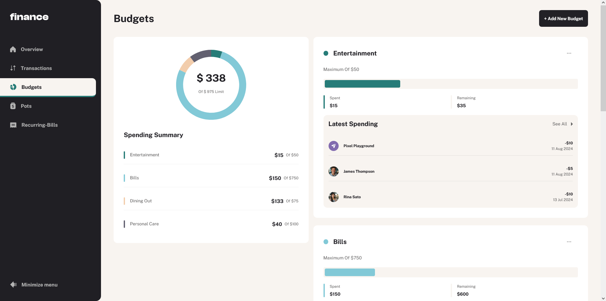

# Frontend Mentor - Personal finance app solution

This repository contains a solution for the [Personal finance app challenge on Frontend Mentor](https://www.frontendmentor.io/challenges/personal-finance-app-JfjtZgyMt1). The project is built using React, TypeScript, and Vite for the frontend, and Node.js with MongoDB for the backend. This app helps users effectively manage their finances, including budgets, transactions, savings pots, and recurring bills.

## Table of contents

- [Overview](#overview)
  - [The challenge](#the-challenge)
  - [Screenshot](#screenshot)
  - [Links](#links)
- [My process](#my-process)
  - [Built with](#built-with)
  - [Continued development](#continued-development)
  - [Useful resources](#useful-resources)
- [Getting started](#getting-started)
- [Environment Variables](#environment-variables)
- [Author](#author)
- [Acknowledgments](#acknowledgments)

## Overview

### The challenge

Users should be able to:

- See all of the personal finance app data at-a-glance on the overview page
- View all transactions on the transactions page with pagination for every ten transactions
- Search, sort, and filter transactions
- Create, read, update, delete (CRUD) budgets and saving pots
- View the latest three transactions for each budget category created
- View progress towards each pot
- Add money to and withdraw money from pots
- View recurring bills and the status of each for the current month
- Search and sort recurring bills
- Receive validation messages if required form fields aren't completed
- Navigate the whole app and perform all actions using only their keyboard
- View the optimal layout for the interface depending on their device's screen size
- See hover and focus states for all interactive elements on the page

### Screenshot

### Links

- Solution URL: [https://github.com/patsy005/personal-finance-app](https://github.com/patsy005/personal-finance-app)
- Live Site URL: [https://personal-finance-app-lemon.vercel.app](https://personal-finance-app-lemon.vercel.app)

## My process

### Built with

- Semantic HTML5 markup
- SCSS
- Flexbox
- Mobile-first workflow
- React
- TypeScript
- Vite
- React Hook Form
- React Select
- Bootstrap
- React Hot Toast
- Node.js
- Express.js
- MongoDB

## Getting started

1. Clone the repository
2. Run `npm install`
3. Create your MongoDB cluster and import data from `data.json`
4. Add `.env` file in the root repository
5. Run the server with `npm start`

## Environment Variables

The following variables are required in the `.env` file:

- `MONGODB_URI`: URL to your MongoDB cluster
- `VITE_API_URL`: URL to your API
- `PORT`: Port number for the local server

## Author

- LinkedIn - [Patrycja Zawadzka](https://www.linkedin.com/in/patrycja-zawadzka-786836217/)
- Frontend Mentor - [@patsy005](https://www.frontendmentor.io/profile/patsy005)

